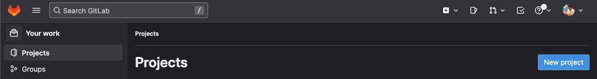
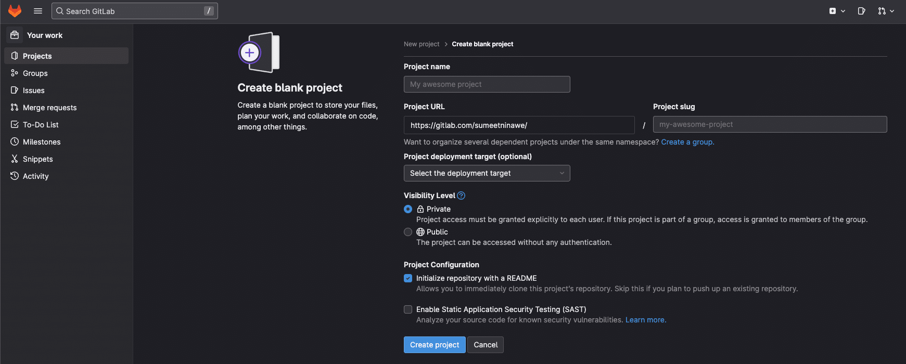
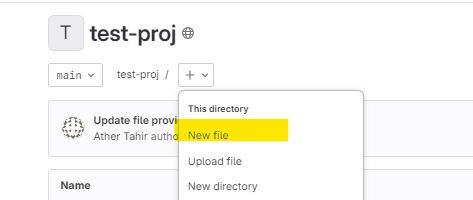
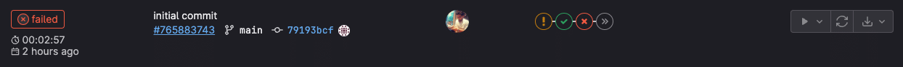
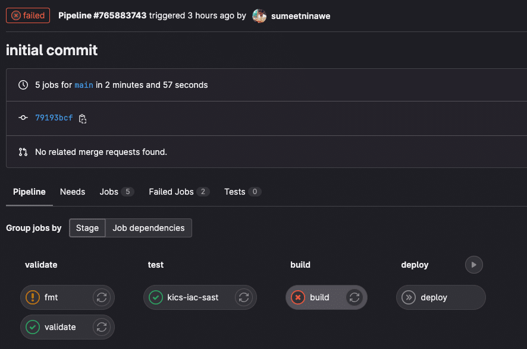
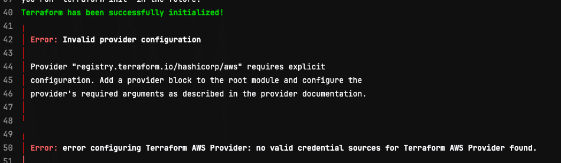
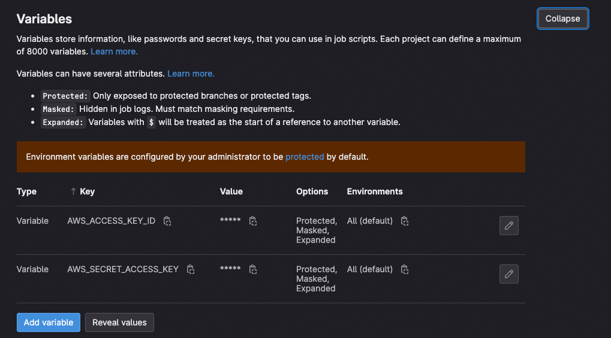

# Lab 18: Gitlab Integration with Terraform 

Various platforms are available to implement CI/CD automation for the Terraform IaC workflows. In this post, we will explore and implement a CI/CD pipeline for Terraform using GitLab. GitLab is a tool that provides remote git repositories and integrated CI/CD automation capabilities.

In this lab, we will look into Terraform configuration, which creates an EC2 instance on AWS. Following is the summary of steps we will take to implement CI/CD on Gitlab.

1. Set up GitLab project repository
2. Create the Terraform configuration files
3. Set up pipelines using .gitlab-ci.yml file
4. Set up AWS Credentials in Gitlab

### Set up a GitLab Project Repository

As a prerequisite, we need a Gitlab account. Create one here and log in to the same.

Ensure you have runners available to run your jobs.

**Important!** Disable shared runners for all the projects that you create. Otherwise, gitlab will fail your pipeline and ask for account verification.


From the homepage, click on the "New Project" button, as shown below.




On the following page, choose to create a blank project – which then navigates to the next page (screenshot below). Provide a name to the project, which is automatically translated as a project slug in the URL.




Click on "Create project." Once the project is created, navigate to the Repository.

In this step, we will create the Terraform configuration in the repository we just cloned. As mentioned earlier, we will create an EC2 instance in AWS using Terraform and Gitlab pipelines.

**Note:** Create all files below ony one one using gitlab online editor:




To begin with, we will create the files below:

- main.tf
- variables.tf
- provider.tf
- output.tf

The configuration below displays the contents of the main.tf file.

```
resource "aws_instance" "my_vm" {
  ami           = var.ami //Ubuntu AMI
  instance_type = var.instance_type

  tags = {
    Name = var.name_tag,
  }
}
```

The resource block defined above would create (manage) an instance of type "t2.micro", using Ubuntu AMI. It also provides a name tag to the instance with the value "My EC2 Instance".

The values are set as defaults in the variables.tf file below.

```
variable "ami" {
  type        = string
  description = "Ubuntu AMI ID in eu-central-1 Region"
  default     = "ami-065deacbcaac64cf2"
}

variable "instance_type" {
  type        = string
  description = "Instance type"
  default     = "t2.micro"
}

variable "name_tag" {
  type        = string
  description = "Name of the EC2 instance"
  default     = "My EC2 Instance"
}
```

Finally, we create the provider configuration in a separate file named provider.tf below.

```
terraform {
  required_providers {
    aws = {
      source  = "hashicorp/aws"
      version = "~> 4.18.0"
    }
  }

  backend "http" {
  }
}

provider "aws" {
  region = "eu-central-1"
}
```

GitLab requires us to declare a provider block with a region attribute assigned explicitly. Optionally, we may create a file (output.tf) to define output variables as below.

```
output "public_ip" {
  value       = aws_instance.my_vm.public_ip
  description = "Public IP Address of EC2 instance"
}

output "instance_id" {
  value       = aws_instance.my_vm.id
  description = "Instance ID"
}
```

### Set up Gitlab Pipeline Using .gitlab-ci.yml

At this point, our Terraform configuration is ready – although we have not tested it. Before pushing this code to our Gitlab repository, we should create the pipeline YAML file in the same repository.

If you are new to Gitlab CI/CD and pipeline configuration, refer to the documentation for all the syntax and conceptual references.

Create a file named ".gitlab-ci.yml" in the project root directory with the following contents. This defines a basic Terraform pipeline in the GitLab CI/CD platform. GitLab provides this template.

```
include:
 - template: Terraform/Base.gitlab-ci.yml  
 - template: Jobs/SAST-IaC.gitlab-ci.yml   

stages:
 - validate
 - test
 - build
 - deploy
 - cleanup

fmt:
 extends: .terraform:fmt
 needs: []

validate:
 extends: .terraform:validate
 needs: []

build:
 extends: .terraform:build

deploy:
 extends: .terraform:deploy
 dependencies:
   - build
 environment:
   name: $TF_STATE_NAME
```

Here we have included a couple of templates at the beginning. In GitLab, it is possible to reuse other YAML templates stored locally, remotely, or in a different project. This improves readability and promotes code reuse. In the YAML file above, we have included a couple of Templates. They are – Base and SAST.

Next, we declared the stage names and defined the same in a sequence. If we look at the stages, they are very much similar to the Terraform operations we would perform in a workflow. To summarize:

1. `fmt` – for formatting the Terraform config.
2. `validate` – validation of code.
3. `build` – initializes the code on the runner.
4. `deploy` – executes terraform apply command.
5. `cleanup` – to destroy the resource.


Each stage uses the keyword "extends" with a certain .terraform:* value. It is a reference to the constructs from the files included at the very beginning.

With these five files created, create a commit and push the code to the Gitlab project/repository.


Navigate to: "Project > Build > Pipelines", and click on the run. Since it is the first run, there should be just one failed entry, as seen below.



Broader view:




### Setup AWS Credentials in GitLab failed entry


Click on the failed job to see the logs, and observe the error message. If you have followed all the steps correctly, then the following error message is valid. If it is not the same, then something else is wrong in your setup.



It is clear that the Terraform has been initialized successfully. However, there are no valid credentials configured for the Terraform AWS Provider. This makes sense since we never configured AWS credentials till now.

To address this issue, navigate to "Settings > CI/CD > Variables", and click on Expand. Add the `AWS_ACCESS_KEY_ID` and `AWS_SECRET_ACCESS_KEY` here. Since these are project-specific CI/CD settings, this information will be made available to the runners via environment variables.



Re-run the pipeline now, and make sure it succeeds.


Note: You will have to deploy stage manually. You can navigate to: "Project > Build > Pipelines" to run the deploy step.

After the pipeline run is successful, confirm the gitlab CI/CD logs.
