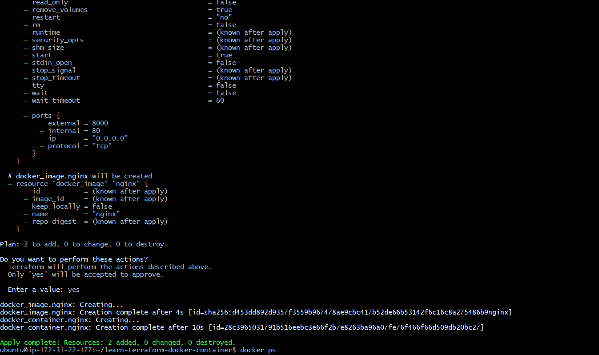
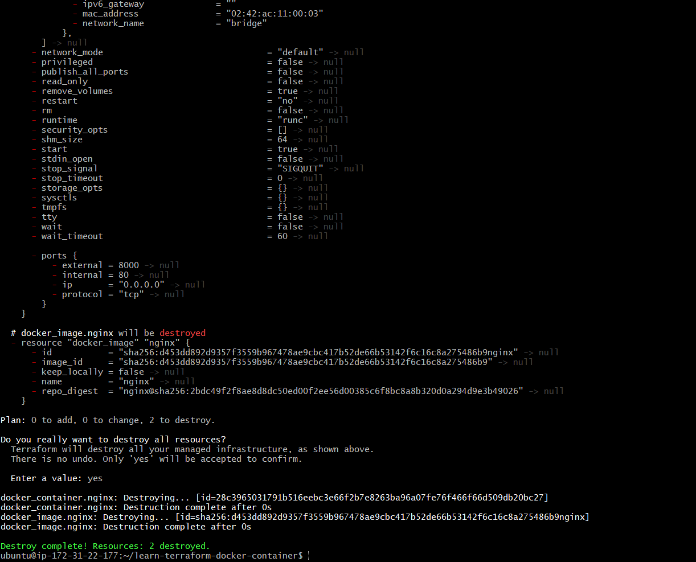

# Lab 6: Deploy Docker Container with Terraform


## Before you begin

1. Before you start this lab, you must make sure to open new terminal and connect with your remote VM before running docker commands below:

`ssh ubuntu@YOUR_VM_DNS_NAME.courseware.io`

**Password:** Will be provided by Instructor.

2. Install Terraform using steps provided below in the VM. After that, you can provision an NGINX server using Docker.


```
cd ~/

wget https://releases.hashicorp.com/terraform/1.6.6/terraform_1.6.6_linux_amd64.zip

unzip terraform_1.6.6_linux_amd64.zip
```

Move the Terraform binary to one of the listed locations. This command
assumes that the binary is currently in your downloads folder and that
your `PATH` includes
`/usr/local/bin`, but you can customize it if your locations are different.


```
sudo mv ~/terraform /usr/local/bin/
```

### Verify the installation

Verify that the installation worked by opening a new terminal session
and listing Terraform\'s available subcommands.

`terraform -help`

## Deploy Docker Container

Create a directory named `learn-terraform-docker-container`.

`mkdir learn-terraform-docker-container`


This working directory houses the configuration files that you write to describe the infrastructure you want Terraform to create and manage. When you initialize and apply the configuration here, Terraform uses this directory to store required plugins, modules (pre-written configurations), and information about the real infrastructure it created.

Navigate into the working directory.

`cd learn-terraform-docker-container`


In the working directory, create a file called main.tf and paste the following Terraform configuration into it.


```
terraform {
  required_providers {
    docker = {
      source  = "kreuzwerker/docker"
      version = "~> 3.0.1"
    }
  }
}

provider "docker" {}

resource "docker_image" "nginx" {
  name         = "nginx"
  keep_locally = false
}

resource "docker_container" "nginx" {
  image = docker_image.nginx.image_id
  name  = "tutorial"

  ports {
    internal = 80
    external = 8000
  }
}
```


Initialize the project, which downloads a plugin called a provider that lets Terraform interact with Docker.

`terraform init`

Provision the NGINX server container with apply. When Terraform asks you to confirm type **yes** and press ENTER.

`terraform apply`




Verify the existence of the NGINX container by visiting `http://YOUR_VM_DNS_NAME.courseware.io:8000` in your web browser or running docker ps to see the container.


NGINX running in Docker via Terraform

 
`docker ps`

Output:

```
CONTAINER ID        IMAGE                     COMMAND                  CREATED             STATUS              PORTS                    NAMES
425d5ee58619        e791337790a6              "nginx -g 'daemon of…"   20 seconds ago      Up 19 seconds       0.0.0.0:8000->80/tcp     tutorial
```

To stop the container, run terraform destroy.

`terraform destroy`



You've now provisioned and destroyed an NGINX webserver with Terraform.

You can exit the SSH session by running `exit` command.
